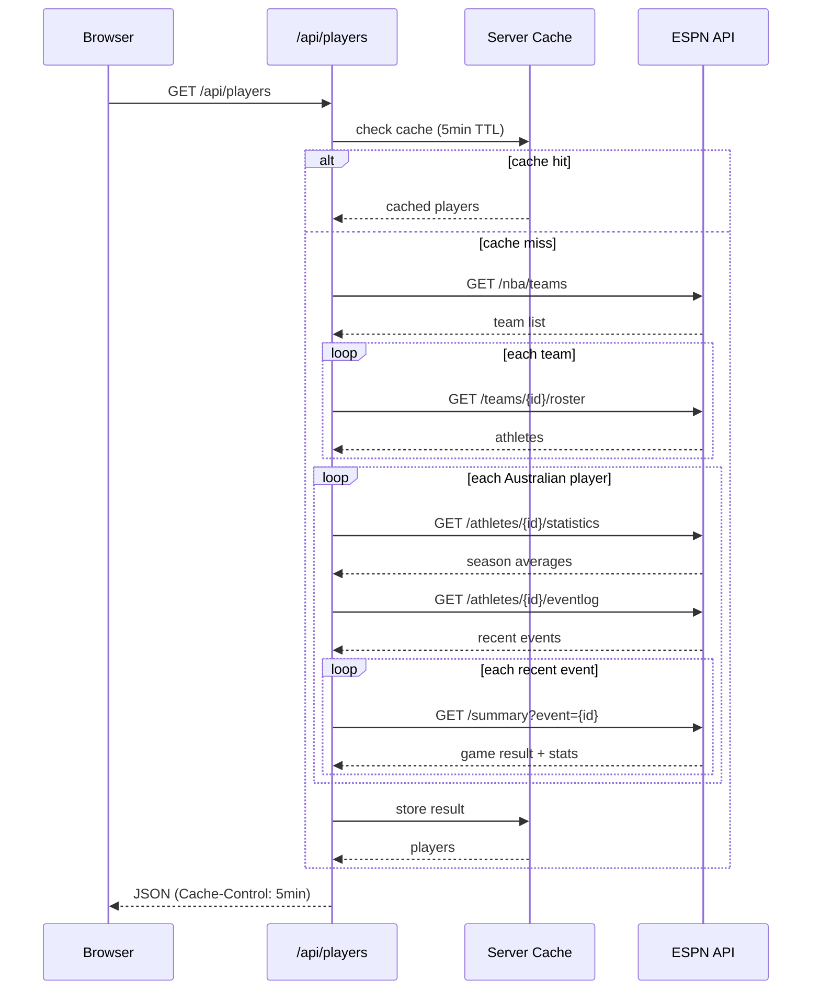

# NBA AU

A Next.js app that tracks per-game statistics for active Australian NBA players, sourced live from ESPN's unofficial API.

## Overview

The app displays a sortable table of Australian players showing:
- **Last game** result (opponent, score, W/L) and how long ago it was played
- **Last game stats** (pts, reb, ast, stl, blk, min, FG%, 3P%, FT%) with a trend arrow comparing to season average
- **Season averages** shown on hover as a tooltip over each stat cell
- **Last 5 games** W/L form, oldest to most recent (left to right), completed games only
- Best values per column highlighted in green (last game) and amber (season)
- Players who haven't played in over 7 days are visually dimmed
- In-progress games shown as LIVE and excluded from Last 5

Data is fetched directly from ESPN's API and cached server-side for 5 minutes.

## API Integration



## Key Integration Points

- **`lib/nbaApi.ts`** — ESPN API client and server-side cache (5-minute TTL). Contains a hardcoded list of Australian player IDs that needs updating when players join or leave the league.
- **`app/api/players/route.ts`** — Next.js API route that calls `nbaApi` and serves cached JSON to the client.
- **`lib/types.ts`** — Shared TypeScript types for players, stats, and API responses.

## Running the App

```bash
npm install
npm run dev
```

The app will be available at [http://localhost:3000](http://localhost:3000).

## Testing

```bash
# Unit tests
npm test

# Unit tests with coverage
npm test -- --coverage

# End-to-end tests (Playwright starts the dev server automatically)
npm run test:e2e
```

## Linting

```bash
npm run lint
```
